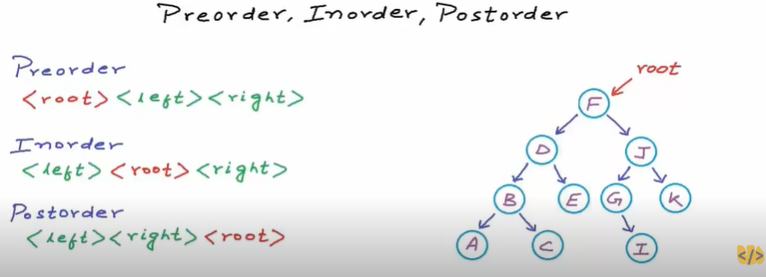

BINARY BASIC
```cpp
#include<stdio.h>
#include<stdlib.h>

typedef struct treeNode{
    int value;
    struct treeNode *left;
    struct treeNode *right;
}treeNode;


treeNode *createNode (int value){
    treeNode* result = (treeNode*)malloc(sizeof(treeNode));
    if (result != NULL){
        result->left = NULL;
        result->right = NULL;
        result->value = value;
    }
}


void printTree (treeNode* root){
    if(root == NULL){
        printf("EMPTY Node\n");
        return;
    }
        
    printf("Value: %d\n",root->value);

    printf("left:\n");  
    printTree(root->left);
  
    printf("right:\n");
    printTree(root->right);

    printf("Done\n");
    
}

int main (){
    
    treeNode* n1 = createNode(10);
    treeNode* n2 = createNode(11);
    treeNode* n3 = createNode(12);
    treeNode* n4 = createNode(13);
    treeNode* n5 = createNode(14);
    
    n1->left = n2;
    n1->right = n3;
    n3->left = n4;
    n3->right = n5;
    
    printTree(n1);
    free(n1);
    free(n2);
    free(n3);
    free(n4);
    free(n5);
    return 0;
}
```
Binary tree Search SUS

```cpp
#include <stdio.h>
#include <stdlib.h>
#include<stdbool.h>

typedef struct treeNode {
    int value;
    struct treeNode *left;
    struct treeNode *right;
} treeNode;

treeNode *createNode(int value) {
    treeNode *result = (treeNode *)malloc(sizeof(treeNode));
    if (result != NULL) {
        result->left = NULL;
        result->right = NULL;
        result->value = value;
    }
    return result;
}

void printTree(treeNode *root) {
    if (root == NULL) {
        printf("EMPTY Node\n");
        return;
    }
        
    printf("Value: %d\n", root->value);

    printf("left:\n");  
    printTree(root->left);
  
    printf("right:\n");
    printTree(root->right);

    printf("Done\n");
}

bool insertTREE(treeNode **root, int value) {
    treeNode *head = *root;
    
    if (*root == NULL) {
        *root = createNode(value);
        return true;
    }
    if (head->value == value) {
        return false;  // Duplicate values are not inserted
    }
    
    if (value < head->value) {
        return insertTREE(&(head->left), value);
    } else {
        return insertTREE(&(head->right), value);
    }
}

void findNumber(treeNode *root, int value) {
    if (root == NULL) {
        printf("Value %d not found in the tree.\n", value);
        return;
    }
    if (root->value == value) {
        printf("Value %d found in the tree.\n", value);
        return;
    }
    
    if (value < root->value) {
        findNumber(root->left, value);
    } else {
        findNumber(root->right, value);
    }
}

int main() {
    treeNode *root = NULL;
   
    insertTREE(&root, 10);
    insertTREE(&root, 11);
    insertTREE(&root, 12);
    insertTREE(&root, 30);
    insertTREE(&root, 14);
    insertTREE(&root, 25);
    
    printTree(root);
    
    int numToFind;
    printf("Enter a value to find: ");
    scanf("%d", &numToFind);
    
    findNumber(root, numToFind);

    return 0;
}
```
TRAVERSE METHOD

https://www.youtube.com/watch?v=gm8DUJJhmY4
### Inorder TRAVERSE
```cpp
#include <stdio.h>
#include <stdlib.h>

struct Node {
    int data;
    struct Node* left;
    struct Node* right;
};

struct Node* createNode(int data) {
    struct Node* node = (struct Node*)malloc(sizeof(struct Node));
    node->data = data;
    node->left = NULL;
    node->right = NULL;
    return node;
}

struct Node* buildTree() {
    int val;
    scanf("%d", &val);

    if (val == -1) {
        return NULL;
    }

    struct Node* root = createNode(val);
    printf("Enter the left child of %d (-1 for no node): ", val);
    root->left = buildTree();
    printf("Enter the right child of %d (-1 for no node): ", val);
    root->right = buildTree();

    return root;
}

void inorderTraversal(struct Node* root) {
    if (root == NULL) {
        return;
    }
    inorderTraversal(root->left);
    printf("%d ", root->data);
    inorderTraversal(root->right);
}

int main() {
    struct Node* root = NULL;

    printf("Enter the root node (-1 for no node): ");
    root = buildTree();

    printf("Inorder Traversal: ");
    inorderTraversal(root);
    printf("\n");

    return 0;
}
```
### PreOrder Traverse
```cpp
#include <stdio.h>
#include <stdlib.h>

// Define the structure for a tree node
typedef struct TreeNode {
    int data;
    struct TreeNode* left;
    struct TreeNode* right;
} TreeNode;

// Function to create a new tree node
TreeNode* createNode(int data) {
    TreeNode* newNode = (TreeNode*)malloc(sizeof(TreeNode));
    newNode->data = data;
    newNode->left = NULL;
    newNode->right = NULL;
    return newNode;
}

// Function to insert nodes in the tree based on user input
TreeNode* insertNode() {
    int data;
    scanf("%d", &data);

    if (data == -1) {
        return NULL;
    }

    TreeNode* newNode = createNode(data);

    printf("Enter the left child of %d (enter -1 to terminate): ", data);
    newNode->left = insertNode();

    printf("Enter the right child of %d (enter -1 to terminate): ", data);
    newNode->right = insertNode();

    return newNode;
}

// Function to perform preorder traversal of the tree
void preorderTraversal(TreeNode* root) {
    if (root == NULL) {
        return;
    }

    printf("%d ", root->data); // Visit the root
    preorderTraversal(root->left); // Traverse the left subtree
    preorderTraversal(root->right); // Traverse the right subtree
}

int main() {
    printf("Enter the root node (enter -1 to terminate): ");
    TreeNode* root = insertNode();

    printf("Preorder Traversal: ");
    preorderTraversal(root);
    printf("\n");

    return 0;
}
```
### Post Order Traversal
```cpp
#include <stdio.h>
#include <stdlib.h>

// Define the structure for a tree node
typedef struct TreeNode {
    int data;
    struct TreeNode* left;
    struct TreeNode* right;
} TreeNode;

// Function to create a new tree node
TreeNode* createNode(int data) {
    TreeNode* newNode = (TreeNode*)malloc(sizeof(TreeNode));
    newNode->data = data;
    newNode->left = NULL;
    newNode->right = NULL;
    return newNode;
}

// Function to insert nodes in the tree based on user input
TreeNode* insertNode() {
    int data;
    scanf("%d", &data);

    if (data == -1) {
        return NULL;
    }

    TreeNode* newNode = createNode(data);

    printf("Enter the left child of %d (enter -1 to terminate): ", data);
    newNode->left = insertNode();

    printf("Enter the right child of %d (enter -1 to terminate): ", data);
    newNode->right = insertNode();

    return newNode;
}

// Function to perform postorder traversal of the tree
void postorderTraversal(TreeNode* root) {
    if (root == NULL) {
        return;
    }

    postorderTraversal(root->left); // Traverse the left subtree
    postorderTraversal(root->right); // Traverse the right subtree
    printf("%d ", root->data); // Visit the root
}

int main() {
    printf("Enter the root node (enter -1 to terminate): ");
    TreeNode* root = insertNode();

    printf("Postorder Traversal: ");
    postorderTraversal(root);
    printf("\n");

    return 0;
}
```
