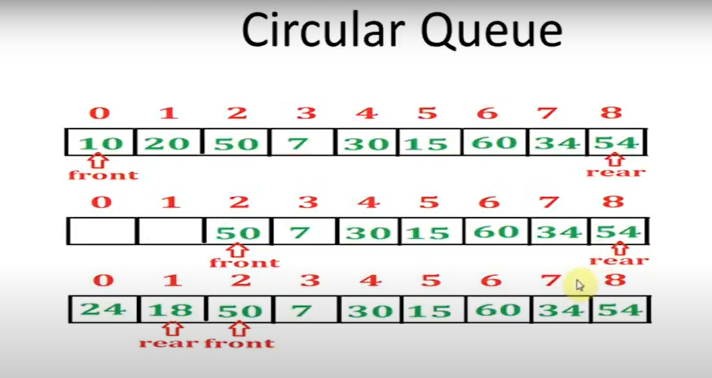
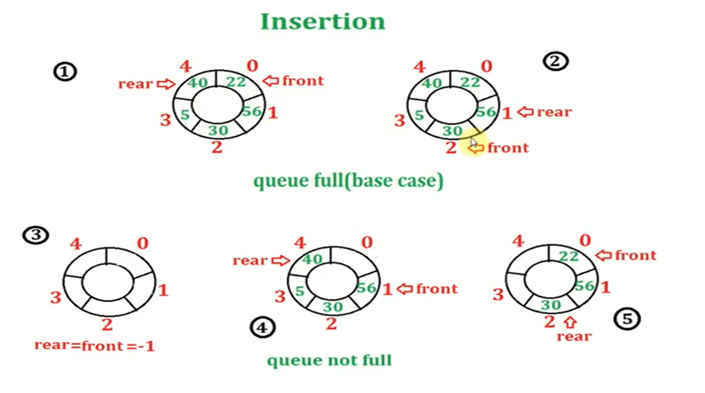
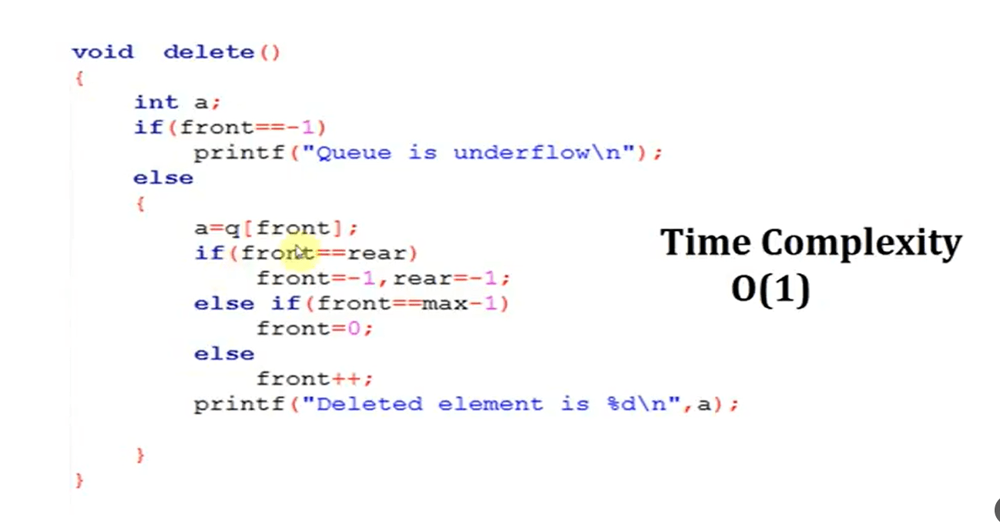
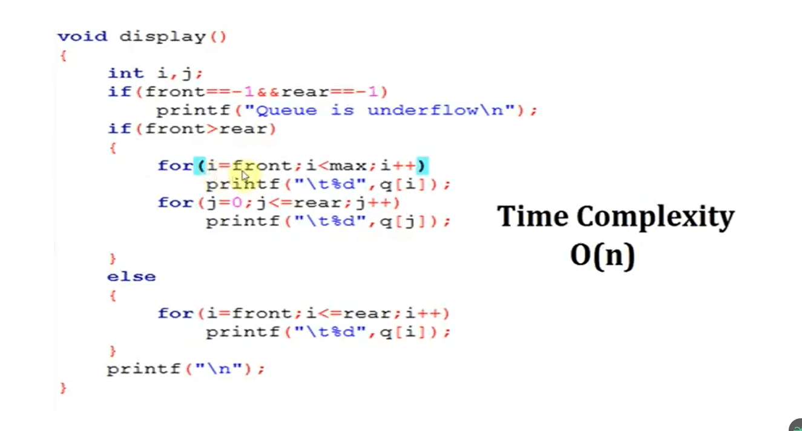

  
* ENQUEUE()
* DEQUEUE()
* DISPLAY()
* MAKENULL()
* PEEK or FRONT()
 
```cpp
#include <stdio.h>
#include <stdlib.h>

typedef struct Node {
    int data;
    struct Node* next;
} Node;

typedef struct {
    Node* front;
    Node* rear;
} QUEUE;

// Initialize an empty queue
void MAKENULL(QUEUE *Q) {
    Q->front = NULL;
    Q->rear = NULL;
}

// Get the front element of the queue
int FRONT(QUEUE *Q) {
    if (Q->front == NULL) {
        printf("Queue is empty.\n");
        return -1;  // Error code
    }
    return Q->front->data;
}

// Add an element to the end of the queue
void ENQUEUE(int x, QUEUE *Q) {
    Node* newNode = (Node*)malloc(sizeof(Node));
    newNode->data = x;
    newNode->next = NULL;

    if (Q->front == NULL) {  // Queue is empty
        Q->front = newNode;
        Q->rear = newNode;
    } else {
        Q->rear->next = newNode;
        Q->rear = newNode;
    }
}

// Remove the front element from the queue
void DEQUEUE(QUEUE *Q) {
    if (Q->front == NULL) {  // Queue is empty
        printf("Queue is empty.\n");
        return;
    }
    Node* temp = Q->front;
    Q->front = Q->front->next;
    if (Q->front == NULL) {
        Q->rear = NULL;
    }
    free(temp);
}

int main() {
    QUEUE Q;
    MAKENULL(&Q);

    ENQUEUE(1000, &Q);
    ENQUEUE(20, &Q);
    ENQUEUE(10, &Q);
    ENQUEUE(10, &Q);

    printf("Front element: %d\n", FRONT(&Q));

    DEQUEUE(&Q);

    printf("Front element after dequeue: %d\n", FRONT(&Q));

    return 0;
}
```

### ARRAY VERSION  
  
```cpp
//* Introduction to Queues
// Queues follow the rule FIFO (First in, First out) or LILO
// enqueue(insert), dequeue(delete)

#include <stdio.h>
#include <stdlib.h>
#include <string.h>
#define MAX 5

typedef struct node {
  int queue[MAX];
  int front;
  int rear;
} QUEUE;

// initialize the queue
QUEUE init();

// insert
void enqueue(QUEUE *main, int newData);

// delete
void dequeue(QUEUE *main);

// return element at the front
void peek(QUEUE *main);

// check if queue is currently empty
void isEmpty(QUEUE *main);

// check if queue is already full
void isFull(QUEUE *main);

// display queue
void display(QUEUE main);

int main(){
  QUEUE jolibee;

  jolibee = init();

  enqueue(&jolibee, 5);

  display(jolibee);

  isEmpty(&jolibee);

  dequeue(&jolibee);

  display(jolibee);

  enqueue(&jolibee, 10);
  enqueue(&jolibee, 20);

  peek(&jolibee);

  display(jolibee);

  isFull(&jolibee);

  enqueue(&jolibee, 30);
  enqueue(&jolibee, 40);
  enqueue(&jolibee, 50);

  display(jolibee);

  isFull(&jolibee);

  dequeue(&jolibee);
  display(jolibee);
  dequeue(&jolibee);
  display(jolibee);
  dequeue(&jolibee);
  display(jolibee);
  dequeue(&jolibee);
  display(jolibee);
  dequeue(&jolibee);
  display(jolibee);

  isEmpty(&jolibee);
}

QUEUE init(){
  QUEUE temp;

  temp.front = -1;
  temp.rear = -1;

  return temp;
}

void enqueue(QUEUE *main, int newData){
  printf("enqueue(%d)\n", newData);

  if (main->front == -1 && main->rear == -1){
    main->front++;
    main->rear = main->front;
    main->queue[main->front] = newData;
  } else {
    if (main->rear < MAX-1){
      main->rear++;
      main->queue[main->rear] = newData;
    } else {
      printf("Stack overflow.");
    }
  }
}

void dequeue(QUEUE *main){
  // if there are no elements yet
  if (main->front == -1 && main->rear == -1){
    printf("Queue underflow.\n");

  // if there is exactly ONE element
  } else if (main->front == main->rear) {
    printf("dequeue(%d)\n", main->queue[main->front]);
    main->front = main->rear = -1;

  // if there are more than one element
  } else {
    printf("dequeue(%d)\n", main->queue[main->front]);
    main->front++;
  }
}

void peek(QUEUE *main){
  printf("peak(%d)\n", main->queue[main->front]);
}

void display(QUEUE main){
  for (; main.front <= main.rear ; main.front++){ printf("%d\t", main.queue[main.front]); }
  printf("\n");
}

void isEmpty(QUEUE *main){
  if (main->front == -1 && main->rear == -1){
    printf("isEmpty() => {Queue underflow.}\n");
  } else {
    printf("isEmpty() => {Queue exists.}\n");
  }
}

void isFull(QUEUE *main){
  if (main->rear == MAX-1){
    printf("isFull() => {Queue is full!}\n");
  } else {
    printf("isFull() => {Queue is not yet full.}\n");
  }
  
}
```

  
### CIRCULAR ARRAY
  
  
  
    
  
  
  
  
  
```cpp
#include <stdio.h>
#include <stdlib.h>

#define MAXSIZE 100  // Define the maximum size of the queue

typedef struct {
    int data[MAXSIZE];
    int front;
    int rear;
} CIRCULAR_QUEUE;

// Initialize an empty circular queue
void MAKENULL(CIRCULAR_QUEUE *Q) {
    Q->front = -1;
    Q->rear = -1;
}

// Add an element to the circular queue
void ENQUEUE(int x, CIRCULAR_QUEUE *Q) {
    // Check if the queue is full
    if ((Q->rear + 1) % MAXSIZE == Q->front) {
        printf("Queue is full.\n");
        return;
    }

    // Check if the queue is initially empty
    if (Q->front == -1) {
        Q->front = 0;
    }

    Q->rear = (Q->rear + 1) % MAXSIZE;
    Q->data[Q->rear] = x;
}

// Remove the front element from the circular queue
void DEQUEUE(CIRCULAR_QUEUE *Q) {
    // Check if the queue is empty
    if (Q->front == -1) {
        printf("Queue is empty.\n");
        return;
    }

    // If the queue has only one element
    if (Q->front == Q->rear) {
        Q->front = -1;
        Q->rear = -1;
    } else {
        Q->front = (Q->front + 1) % MAXSIZE;
    }
}

// Get the front element of the circular queue
int FRONT(CIRCULAR_QUEUE *Q) {
    // Check if the queue is empty
    if (Q->front == -1) {
        printf("Queue is empty.\n");
        return -1;  // Error code
    }
    return Q->data[Q->front];
}

// Display the elements of the circular queue
void DISPLAY(CIRCULAR_QUEUE *Q) {
    if (Q->front == -1) {
        printf("Queue is empty.\n");
        return;
    }

    printf("Queue elements: ");
    int i = Q->front;
    while (1) {
        printf("%d ", Q->data[i]);
        if (i == Q->rear) break;
        i = (i + 1) % MAXSIZE;
    }
    printf("\n");
}

int main() {
    CIRCULAR_QUEUE Q;
    MAKENULL(&Q);

    ENQUEUE(1000, &Q);
    ENQUEUE(20, &Q);
    ENQUEUE(10, &Q);
    ENQUEUE(30, &Q);

    DISPLAY(&Q);  // Display the queue elements

    printf("Front element: %d\n", FRONT(&Q));

    DEQUEUE(&Q);
    DEQUEUE(&Q);

    DISPLAY(&Q);  // Display the queue elements after dequeuing

    printf("Front element after dequeuing two elements: %d\n", FRONT(&Q));

    return 0;
}
```
### PREMID

```cpp
Boolean isAscendingID(studQueue q) {
    Boolean B = TRUE; // Start assuming the IDs are in ascending order (TRUE)
    struct node* temp = q.front; // Use a temporary pointer for traversal
    
    for (int i = 0; i < q.count - 1 && temp != NULL; i++) { 
        if (temp->stud.ID > temp->link->stud.ID) {
            B = FALSE; // Set B to FALSE if IDs are not in ascending order
            break; // Exit the loop early if condition fails
        }
        temp = temp->link; // Move to the next node
    }
    
    return B; // Return TRUE if ascending, FALSE otherwise
}
```
  
### EXAMPLE CICULAT 1

```cpp
#include <stdio.h>
#include <stdbool.h>
#define MAX 7

typedef struct {
    int elem[MAX];
    int count;
    int front;
    int rear;
} QUEUE;

QUEUE initQueue();
bool isFull(QUEUE main);
bool isEmpty(QUEUE main);
void enqueue(QUEUE *main, int newData);
void dequeue(QUEUE *main);
void displayQueue(QUEUE main);
void dequeueData(QUEUE *main, int data);

int main() {
    QUEUE Vikings = initQueue();

    enqueue(&Vikings, 1);
    enqueue(&Vikings, 2);
    enqueue(&Vikings, 3);
    enqueue(&Vikings, 4);
    enqueue(&Vikings, 5);
    enqueue(&Vikings, 6);
    enqueue(&Vikings, 7);

    displayQueue(Vikings);
    
    // Dequeuing a specific data
    dequeueData(&Vikings, 4);  // Dequeue the specified data
    displayQueue(Vikings);

    dequeue(&Vikings);  // Perform normal dequeue
    displayQueue(Vikings);
}

QUEUE initQueue() {
    QUEUE newQueue;

    newQueue.rear = -1; 
    newQueue.front = 0; 
    newQueue.count = 0;

    printf("Successfully initialized queue!\n");
    return newQueue;
}

bool isFull(QUEUE main) {
    return main.count == MAX;
}

bool isEmpty(QUEUE main) {
    return main.count == 0;  
}

void enqueue(QUEUE *main, int newData) {
    if (!isFull(*main)) {
        main->rear = (main->rear + 1) % MAX;
        main->elem[main->rear] = newData;
        main->count++;
    } else {
        printf("Queue is full. Enqueue is not possible.\n");
    }
}

void dequeue(QUEUE *main) {
    if (!isEmpty(*main)) {
        printf("Dequeued: %d\n", main->elem[main->front]); // Displaying the dequeued item
        main->front = (main->front + 1) % MAX;
        main->count--;
    } else {
        printf("Queue is empty. Dequeue is not possible.\n");
    }
}

void displayQueue(QUEUE main) {
    if (!isEmpty(main)) {
        printf("Queue elements: ");
        int x = main.front;
        for (int i = 0; i < main.count; i++) {
            printf("%d ", main.elem[(x + i) % MAX]);
        }
        printf("\n");
    } else {
        printf("No queue to display.\n");
    }
}

void dequeueData(QUEUE *main, int data) {
    if (isEmpty(*main)) {
        printf("Queue is empty. Cannot delete data.\n");
        return;
    }

    // Dequeue until we find the specified data
    while (!isEmpty(*main)) {
        if (main->elem[main->front] == data) {
            printf("Dequeued data: %d\n", data);
            dequeue(main);  // Call the regular dequeue function to remove the data
            return;
        }
        dequeue(main);  // Dequeue the current element
    }

    printf("Data %d not found in the queue.\n", data);
}

```  
### VERSION 2

```cpp
// AUTHOR   :   LANUTAN, ACHILLE LORENZO - 22103514
// DATE     :   MONDAY, SEPTEMBER 18, 2023
// DESC     :   This is a circular array implementation of a list VERSION 2. Meaning, we are
//              sacrificing one cell/element in order to tell if the list is EMPTY or FULL.

#include <stdio.h>
#include <stdbool.h>

#define MAX 8

typedef struct{
  char elem[MAX];
  int rear;
  int front;
} QUEUE;

void initQueue(QUEUE *main);
bool isEmpty(QUEUE main);
bool isFull(QUEUE main);
void enqueue(QUEUE *main, char newData);
void dequeue(QUEUE *main);
void displayQueue(QUEUE main);

int main(){
  QUEUE McDonalds;

  initQueue(&McDonalds);

  enqueue(&McDonalds, 'M');  
  enqueue(&McDonalds, 'C');
  enqueue(&McDonalds, 'D');
  enqueue(&McDonalds, 'O');
  enqueue(&McDonalds, 'N');
  enqueue(&McDonalds, 'A');
  enqueue(&McDonalds, 'L');
  enqueue(&McDonalds, 'D');
  enqueue(&McDonalds, 'S');
  
  // dequeue(&McDonalds);
  // dequeue(&McDonalds);
  // dequeue(&McDonalds);
  // dequeue(&McDonalds);
  // dequeue(&McDonalds);
  // dequeue(&McDonalds);
  // dequeue(&McDonalds);
  // dequeue(&McDonalds);
  // dequeue(&McDonalds);
  // dequeue(&McDonalds);
  // dequeue(&McDonalds);
  
  displayQueue(McDonalds);

}

void initQueue(QUEUE *main){
  // We can choose to initialize our queue anywhere as it is circular
  main->rear = 0;
  main->front = 1;

  printf("Initialized the queue successfully!\n\n");
}

bool isFull(QUEUE main){
  return (main.rear + 2) % MAX == main.front;
}

bool isEmpty(QUEUE main){
  return (main.rear + 1) % MAX == main.front;
}

void enqueue(QUEUE *main, char newData){
  bool FULL = isFull(*main);

  // if not full, proceed to enqueue
  if (!FULL){
    printf("enqueue(%c)\n", newData);
    main->rear = (main->rear + 1) % MAX;
    main->elem[main->rear] = newData;
  } else {
    printf("Enqueue() is not allowed. Queue full.\n");
  }
}

void dequeue(QUEUE *main){
  bool EMPTY = isEmpty(*main);

  // if not empty, proceed to dequeue
  if (!EMPTY){
    printf("\ndequeue(%c)", main->elem[main->front]);

    main->front = (main->front + 1) % MAX;
  } else {
    printf("\nDequeue() is not allowed. Queue is empty.");
  }
}

void displayQueue(QUEUE main){
  int x;
  
  printf("\nCASHIER :: ");
  for (x = main.front ; x != (main.rear + 1) % MAX ; x = (x + 1) % MAX){
    printf("\n%c\t%d", main.elem[x], x);
  }
  printf("\n");
}
```
