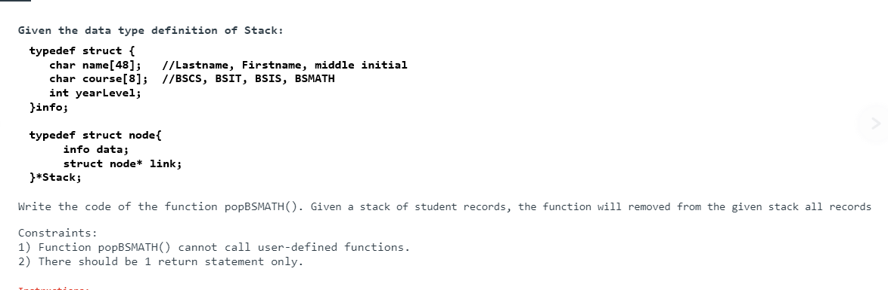

# Simple Stack


# Stack Linked List *Stack

```c
// Online C compiler to run C program online
#include <stdio.h>
#include <stdlib.h>

// Define node structure linked list version sa stack
typedef struct Node{
    int data;
    struct Node* next;
} *Stack;


int IsEmpty (Stack top){ // function to check if the stack is empty
    return top == NULL;  // Return true if the stack top is NULL
}

// initialize stack
void Init(Stack* top){
    *top = NULL;
}

// Push an Element onto the stack
void Push(Stack* top, int data){
    Stack newNode = (Stack)malloc(sizeof(struct Node));
    if(!newNode){ // (newnode == NULL) // Safety Feature 
              printf("Memory allocation failed\n");
              return;
    }
    newNode->data = data;
    newNode->next = *top;
    *top = newNode;
}

void Pop(Stack* top) {
    if (!IsEmpty(*top)) {  // Pass the stack top directly to IsEmpty
        Stack temp = *top;
        *top = (*top)->next;
        free(temp);
    } else {
        printf("Stack underflow\n");
    }
}

int Peek(Stack* top) {
    if (IsEmpty(*top)) {  // Pass the stack top directly to IsEmpty
        printf("Stack is empty\n");
        return -1;  // Return a sentinel value to indicate an error
    }
    return (*top)->data;
}


void display(Stack* top){
    if (IsEmpty(*top)) {  // Pass the stack top directly to IsEmpty
        printf("Stack is empty\n");
    }
    Stack temp = *top;
    while (temp != NULL){
        printf("%d\n", temp->data);
        temp = temp->next;
    }
}

int main() {
  
Stack top;
Init(&top);
display(&top);

    int poppedData;

 // Push 6 elements onto the stack
for (int i = 0; i < 6; i++) {
    printf("Enter the data to push: ");
    int data;
    scanf("%d", &data);
    Push(&top, data);
    display(&top); 
}


printf("Remove/ Pop an element from the stack\n");
// Pop an element from the stack
Pop(&top);
printf("Main Stack\n");
display(&top);  // Display the stack after popping
    
// Peek at the top element
poppedData = Peek(&top);  // Pass stack top directly
if (poppedData != -1) {
        printf("Top element is %d\n", poppedData);
}

    

    return 0;
}
```
# Stack Midterm Quiz




```cpp
Stack* popBSMATH(Stack *s) { 
    Stack* newStack = NULL;  // New stack initialized to NULL 
    Stack* trav = s;         // Pointer to hold the traversal node
    Stack temp;              // Temporary pointer to hold nodes
    // Use a for loop to traverse the original stack
    for (; *trav != NULL; ) {  
        if (strcmp((*trav)->data.course, "BSMATH") == 0) {
            // Create a new node for the new stack
            Stack newNode = (Stack)malloc(sizeof(struct node)); // Allocate memory for new node
            
            newNode->data = (*trav)->data;  // Copy data from the original stack node
            newNode->link = newStack;       // Add new node to the top of newStack
            newStack = newNode;             // Update newStack to point to the new node

            // Remove the node from the original stack
            temp = *trav;                   // Hold the node to be deleted
            *trav = (*trav)->link;          // Move to the next node in the original stack
            free(temp);                     // Free the removed node
        } else {
            trav = &(*trav)->link;          // Move to the next node
        }
    }

    return newStack;  // Return the new stack with only BSMATH students
}
```  
  
### Return A New Sorted Stack
```cpp
Stack* CreateSortedStack(Stack* top) {
    Stack* sortedStack = (Stack*)malloc(sizeof(Stack));
    *sortedStack = NULL;  // Initialize the new stack to NULL

    // Use while loop to process each element from the original stack
    while (*top != NULL) {
        // Pop the top element from the original stack
        Stack tempNode = *top;
        *top = (*top)->next;
        info tempData = tempNode->data;
        free(tempNode);

        // Insert tempData into the correct position in the sorted stack
        Stack newNode = (Stack)malloc(sizeof(struct Node));
        newNode->data = tempData;

        Stack* trav;  // Pointer to pointer to Node for traversal
        // Use for loop for traversal in the sorted stack
        for (trav = sortedStack; *trav != NULL && (*trav)->data.yearlevel < newNode->data.yearlevel; trav = &((*trav)->next));

        newNode->next = *trav;
        *trav = newNode;
    }

    return sortedStack;
}
```
  
  
### Sort only the info  
  
```cpp
void SortStackInfoByYear(Stack* top) {
    Stack i, j;
    info temp;

    // Outer loop to go through each element in the stack
    for (i = *top; i != NULL; i = i->next) {
        // Inner loop to compare the current element with the rest of the stack
        for (j = i->next; j != NULL; j = j->next) {
            if (i->data.yearlevel > j->data.yearlevel) {
                // Swap the info data between i and j
                temp = i->data;
                i->data = j->data;
                j->data = temp;
            }
        }
    }
```
  
### Sort a Stacks Data without Returning   
  
```cpp
void SortStack(Stack* top) {
    Stack i, j;
    int temp;

    for (i = *top; i != NULL; i = i->next) {
        for (j = i->next; j != NULL; j = j->next) {
            if (i->data > j->data) {
                temp = i->data;
                i->data = j->data;
                j->data = temp;
            }
        }
    }
}
```  
  
### RETURN THE NEW STACK  
  
```cpp
Stack SortStack(Stack* top) {
    Stack sortedStack = NULL;
    Stack current;

    while (*top != NULL) {
        current = *top;  // Get the top element
        *top = (*top)->next;  // Move the top pointer to the next element

        // Create a new node with the current data
        Stack newNode = (Stack)malloc(sizeof(struct Node));
        newNode->data = current->data;
        newNode->next = NULL;

        // Insert the new node into the sorted stack
        if (sortedStack == NULL || sortedStack->data >= newNode->data) {
            newNode->next = sortedStack;
            sortedStack = newNode;
        } else {
            Stack trav = sortedStack;
            while (trav->next != NULL && trav->next->data < newNode->data) {
                trav = trav->next;
            }
            newNode->next = trav->next;
            trav->next = newNode;
        }

        free(current);  // Free the original node
    }

    return sortedStack;  // Return the sorted stack
}
```

### Stack Array Militante
```c
#include<stdio.h>
#include<stdbool.h>

#define MAX 5

typedef struct {
    int data[MAX];
    int top;
} Stack;

void initStack(Stack* s){
    s->top = -1;
}

bool isEmpty(Stack s){
    return s.top == -1;
}

bool isFull(Stack s){
    return s.top == MAX - 1;
}

void push(Stack* s, int new_data){
    if(!isFull(*s)){
         s->data[++(s->top)] = new_data;
    }else{
        printf("Stack is Full\n");
    }
}

int pop(Stack* s){
    if(!isEmpty(*s)){
    int temp = s->data[(s->top)--];
     return temp;
    }else{
        printf("Stack is not Empty\n");
    }
}

int peek(Stack s){
     int top = -1;
    if(!isEmpty(s)){
      top = s.data[s.top];
      return top;
    }else{
        return top;
        printf("Stack is not Empty\n");
    }
   
}

void displayV1(Stack s){
    if(!isEmpty(s)){
        Stack temp;
        initStack(&temp);

        while(!isEmpty(s)){
            int val = peek(s);
            printf("%d ", val);
            push(&temp, val);
            pop(&s);
        }
        printf("\nDisplay V1 Successful\n");
    } else {
        printf("Stack is Empty\n");
    }
}


void displayArrayVersion(Stack s){
    if(!isEmpty(s)){
        for(int i = s.top; i >= 0; i--){
            printf("%d ", s.data[i]);
        }
        printf("\nDisplay V1 Successful\n");
    }else{
        printf("Stack is Empty\n");
    }
}

void displayV2(Stack s){
    if(!isEmpty(s)){
        Stack temp;
        initStack(&temp);
        int i;
        for(i = 0; s.top != -1; i++){
            push(&temp, peek(s));
            printf("%d ",pop(&s));
        }
        
        for(i = 0; temp.top != -1; i++){
            push(&s, pop(&temp));
        }
        printf("\nDisplay V2 Successful\n");
    }else{
        printf("Stack is Empty\n");
    }
}

int main(){
    
    Stack myStack;
    
    initStack(&myStack);
    printf("%s\n", isEmpty(myStack) ? "Stack is Empty" : "Stack is not Empty");
    printf("%s\n", isFull(myStack) ? "Stack is Full" : "Stack is not yet Full");
    
    push(&myStack, 10);
    push(&myStack, 20);
    push(&myStack, 30);
    push(&myStack, 40);
    push(&myStack, 50);
    printf("The Deleted Element is: %d\n", pop(&myStack));
    printf("The Deleted Element is: %d\n", pop(&myStack));
    printf("The Deleted Element is: %d\n", pop(&myStack));
    printf("The Top Element is: %d\n",peek(myStack));
      printf("The Deleted Element is: %d\n", pop(&myStack));
        printf("The Deleted Element is: %d\n", pop(&myStack));
            printf("The Top Element is: %d\n",peek(myStack));
    // printf("The Top Element is: %d\n",peek(myStack));
    // printf("The Deleted Element is: %d\n", pop(&myStack));
    // printf("The Top Element is: %d\n",peek(myStack));
    // push(&myStack, 60);
    // printf("The Top Element is: %d\n",peek(myStack));
    // push(&myStack, 70);
    // printf("The Top Element is: %d\n",peek(myStack));
    //  push(&myStack, 70);
    //   push(&myStack, 70);
    //   push(&myStack, 70);
    return 0;
}

```
